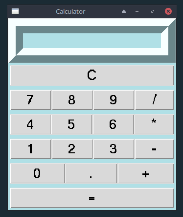

# calculator-tkinter
Python language training. 

Expanding programming skills.
Python Calculator – Create A Simple GUI Calculator Using Tkinter.

[Python Calculator Tutorial – Getting Started With Tkinter.](https://www.simplifiedpython.net/python-calculator/)

Installation.
[To start the program, install tkinter.](https://riptutorial.com/tkinter/example/3206/installation-or-setup)

 

Обучение языку Python. 
Расширение навыков программирования.

Калькулятор на Python - создание простого калькулятора GUI с помощью Tkinter.

[Учебное пособие по калькулятору питона - Начало работы с Tkinter.](https://www.simplifiedpython.net/python-calculator/)

Установка.
[Для запуска программы установите tkinter.](https://riptutorial.com/tkinter/example/3206/installation-or-setup)
